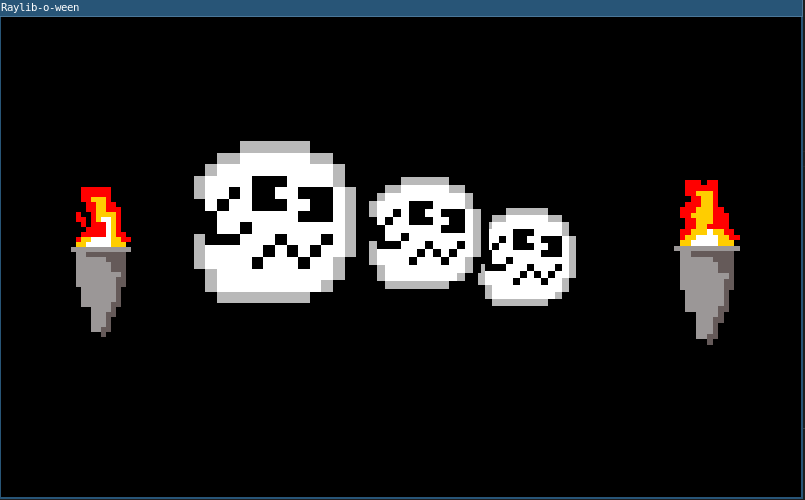

# raylib-o-ween 
I made this as a quick and dirty decoration for the front of my house. It was designed to run on a Raspberry Pi Zero with a JoyBonnet with the buttons mapped WASD for directions and UOJL for the 4 face buttons as well as Enter for the Start button.

| Game Button   | Keyboard Button   | Action                                        | SCALE MODE action                     | MOVE MODE action  | SELECT MODE action        |
| ---           | ---               | ---                                           | ---                                   | ---               | ---                       |
| GB_UP         | KEY_W             |                                               | scale selected decoration up 0.1      | move up           |                           | 
| GB_DOWN       | KEY_S             |                                               | scale selected decoration down 0.1    | move down         |                           |
| GB_LEFT       | KEY_A             |                                               | scale selected decoration down 1.0    | move left         | select previous decoration|
| GB_RIGHT      | KEY_D             |                                               | scale selected decoration up 1.0      | move right        | select next decoration    |
| GB_Y          | KEY_U             | add new decoration                            |                                       |                   |                           |
| GB_X          | KEY_O             | remove current decoration                     |                                       |                   |                           |
| GB_B          | KEY_J             | switch the selected decoration's sprite       |                                       |                   |                           |
| GB_A          | KEY_L             | switch between MOVE, SCALE, and SELECT modes  |                                       |                   |                           |
| GB_START      | KEY_ENTER         | exit the program                              |                                       |                   |                           |

# animation
Each sprite is a single image. The program assumes all sprites are displayed as squares. 

It treats each image as a sprite sheet with the sprites in a horizontal row. It assumes each frame has a width equal to the height of the image. For instance if you give it an image that is 32 pixels height and 320 pixels wide it'll treat it as an animated sprite that is 32 pixels by 32 pixels with 10 frames of animation.

Animations play in a loop. Right now they all run at the same framerate.

# code quality is low
I know the code quality is low. I made this in an hour the day before Halloween.

# targets
I build and run this on Ubuntu 20.04 and Raspberry Pi OS Lite on Raspberry Pi Zero.